# Fluxo de Desenvolvimento — Ebook Factory

> **Plano principal:** [`docs/superpowers/plans/2026-06-15-ebook-factory.md`](../plans/2026-06-15-ebook-factory.md)
> **Tasks:** [`task-1.md`](task-1.md) a [`task-7.md`](task-7.md)

## Visão Geral das Dependências

```mermaid
flowchart TD
    %% Estilo
    classDef phase0 fill:#e1f5fe,stroke:#01579b
    classDef phase1 fill:#fff3e0,stroke:#e65100
    classDef phase2 fill:#e8f5e9,stroke:#1b5e20
    classDef phase3 fill:#fce4ec,stroke:#880e4f
    classDef phase4 fill:#f3e5f5,stroke:#4a148c
    classDef phase5 fill:#fff8e1,stroke:#f57f17
    classDef phase6 fill:#e0f7fa,stroke:#00695c
    classDef phase7 fill:#fbe9e7,stroke:#bf360c

    %% Phase 0
    subgraph Fase0 ["Fase 0 — Fundação"]
        direction LR
        0_1["0.1 Monorepo"]:::phase0
        0_2["0.2 Docker Compose"]:::phase0
        0_3["0.3 CI/Pre-commit"]:::phase0
    end

    %% Phase 1
    subgraph Fase1 ["Fase 1 — Backend Core"]
        direction TB
        1_1["1.1 FastAPI skeleton"]:::phase1
        1_2["1.2 DB session"]:::phase1
        1_3["1.3 Domain models"]:::phase1
        1_4["1.4 Alembic"]:::phase1
        1_5["1.5 Project CRUD"]:::phase1
        1_6["1.6 Chapter/Artifact/Approval"]:::phase1
        1_7["1.7 Storage client"]:::phase1
        1_8["1.8 Redis + health"]:::phase1
    end

    %% Phase 2
    subgraph Fase2 ["Fase 2 — Workflow Engine"]
        direction TB
        2_1["2.1 Workflow state"]:::phase2
        2_2["2.2 Base graph"]:::phase2
        2_3["2.3 Checkpoints"]:::phase2
        2_4["2.4 Resume"]:::phase2
        2_5["2.5 Endpoints"]:::phase2
    end

    %% Phase 3
    subgraph Fase3 ["Fase 3 — AI Agents"]
        direction TB
        3_1["3.1 LLM client"]:::phase3
        3_2["3.2 Idea Agent"]:::phase3
        3_3["3.3 Outline Agent"]:::phase3
        3_4["3.4 Writer Agent"]:::phase3
        3_5["3.5 Reflection Agent"]:::phase3
        3_6["3.6 Reflection loop"]:::phase3
        3_7["3.7 Workflow integration"]:::phase3
    end

    %% Phase 4
    subgraph Fase4 ["Fase 4 — Frontend"]
        direction TB
        4_1["4.1 Next.js setup"]:::phase4
        4_2["4.2 API client"]:::phase4
        4_3["4.3 Telas principais"]:::phase4
        4_4["4.4 SSE streaming"]:::phase4
        4_5["4.5 Versões/traces"]:::phase4
    end

    %% Phase 5
    subgraph Fase5 ["Fase 5 — Conversão"]
        direction TB
        5_1["5.1 Pandoc service"]:::phase5
        5_2["5.2 Export endpoint"]:::phase5
        5_3["5.3 Async worker"]:::phase5
        5_4["5.4 Frontend export"]:::phase5
    end

    %% Phase 6
    subgraph Fase6 ["Fase 6 — Observabilidade"]
        direction TB
        6_1["6.1 OpenTelemetry"]:::phase6
        6_2["6.2 Prometheus"]:::phase6
        6_3["6.3 Langfuse"]:::phase6
        6_4["6.4 Grafana"]:::phase6
    end

    %% Phase 7
    subgraph Fase7 ["Fase 7 — Polimento MVP"]
        direction TB
        7_1["7.1 Auth"]:::phase7
        7_2["7.2 Error handling"]:::phase7
        7_3["7.3 Versioning UI"]:::phase7
        7_4["7.4 Cost tracking"]:::phase7
        7_5["7.5 E2E tests"]:::phase7
        7_6["7.6 Docs"]:::phase7
    end

    %% Conexões
    0_1 --> 1_1
    0_1 --> 4_1
    0_2 --> 1_2
    0_2 --> 1_7
    0_2 --> 6_3

    1_1 --> 1_2
    1_1 --> 1_5
    1_1 --> 1_8
    1_1 --> 2_5
    1_1 --> 7_2

    1_2 --> 1_3
    1_2 --> 1_8

    1_3 --> 1_4
    1_3 --> 1_5
    1_3 --> 1_6

    1_5 --> 1_6

    1_5 --> 4_2 --> 4_3

    4_3 --> 4_4
    4_3 --> 4_5
    4_3 --> 7_3

    2_1 --> 2_2
    2_1 --> 2_3
    2_2 --> 2_4
    2_3 --> 2_4
    2_4 --> 2_5
    2_5 --> 3_7

    3_1 --> 3_2
    3_1 --> 3_3
    3_1 --> 3_4
    3_1 --> 3_5
    3_5 --> 3_6
    3_2 --> 3_7
    3_3 --> 3_7
    3_4 --> 3_7
    3_6 --> 3_7

    5_1 --> 5_2 --> 5_3 --> 5_4
    5_4 --> 7_5

    6_1 --> 6_4
    6_2 --> 6_4

    7_1 --> 7_5
    7_3 --> 7_5
    7_4 --> 7_5

    %% Conexões entre fases
    1_5 -.-> 4_2
    1_6 -.-> 4_3
    2_2 -.-> 3_7
    4_3 -.-> 5_4
    4_3 -.-> 7_3
    4_3 -.-> 7_4
    6_2 -.-> 7_4
```



## Linha do Tempo Recomendada

### Sprint 1 — Fundação + Backend Core

```
Semana 1        | 0.1 ──┬── 1.1 ──┬── 1.5 ── 1.6 ──┐
                          │         ├── 1.2 ── 1.3 ── 1.4 │
                          │         └── 1.8               │
                          ├── 0.2 ──┐                     │
                          │        ├── 1.7                │
                          │        └── 6.3               │
                          └── 0.3                        │
                                                         ▼
                                              Sprint 1 Done
```

**Parallelizável nesta sprint:**

| Track | Tasks | Pré-requisito |
|-------|-------|---------------|
| A (Backend API) | 0.1 → 1.1 → **em paralelo** 1.2+1.5+1.8 → 1.3 → 1.4 → 1.6 | 0.1 |
| B (Storage) | 0.2 → 1.7 | 0.2 sobe MinIO |
| C (CI) | 0.3 | 0.1 |
| D (Langfuse) | 0.2 → 6.3 | 0.2 |

Tracks A e B podem rodar **em paralelo** após 0.1+0.2 estarem prontos.

---

### Sprint 2 — Workflow Engine + AI Agents

```
Semana 2        | 2.1 ──┬── 2.2 ── 2.4 ── 2.5 ──┐
                          └── 2.3 ──┘              │
                                                   ▼
                   3.1 ──┬── 3.2 ──┐             3.7 ── Sprint 2 Done
                          ├── 3.3 ──┤
                          ├── 3.4 ──┤
                          └── 3.5 ── 3.6 ──┘
```

**Parallelizável nesta sprint:**

| Track | Tasks | Pré-requisito |
|-------|-------|---------------|
| A (Workflow) | 2.1 → **em paralelo** 2.2+2.3 → 2.4 → 2.5 | 1.1 |
| B (LLM) | 3.1 → **em paralelo** 3.2+3.3+3.4+3.5 → 3.6 | — |
| C (Integração) | 3.7 | A + B |

Tracks A e B rodam **em paralelo**. Track C depende de ambas.

**Dentro da Track B**, agentes 3.2, 3.3, 3.4, 3.5 podem rodar **todos em paralelo** após 3.1.

---

### Sprint 3 — Frontend

```
Semana 3        | 4.1 ── 4.2 ── 4.3 ──┬── 4.4 ──┐
                                      └── 4.5 ──┤
                                                ▼
                                     Sprint 3 Done
```

**Paralelizável:** 4.4 e 4.5 podem rodar em paralelo após 4.3.

Track única (dependência linear forte):

| Track | Tasks |
|-------|-------|
| A (UI) | 4.1 → 4.2 → 4.3 → **em paralelo** 4.4 + 4.5 |

---

### Sprint 4 — Conversão + Observabilidade + Polimento

```
Semana 4        | 5.1 ── 5.2 ── 5.3 ── 5.4 ──┐
                 6.1 ──┐                      │
                 6.2 ──┤                      │
                 6.3 ──┼── 6.4 ──┐           │
                 |               |           │
                 7.1 ──┐         |           │
                 7.2 ──┤         |           │
                 7.3 ──┼── 7.4 ──┤           │
                 7.6 ──┘         |           │
                                 ▼           ▼
                                     Sprint 4 Done
```

**Parallelizável nesta sprint:**

| Track | Tasks | Pré-requisito |
|-------|-------|---------------|
| A (Conversão) | 5.1 → 5.2 → 5.3 → 5.4 | 1.6 |
| B (OTEL) | 6.1 → 6.4 | 1.1 |
| C (Prometheus) | 6.2 → 6.4 | — |
| D (Langfuse) | 6.3 → 6.4 | 0.2 |
| E (Auth + OTP) | 7.1 | 1.5 + 1.8 (Redis) |
| F (Erros) | 7.2 | 1.1 |
| G (Versões) | 7.3 | 4.3 |
| H (Custos) | 7.4 | 6.2 + 4.3 |
| I (Docs) | 7.6 | — |

**Todas as tracks A-I rodam em paralelo.** Track J (E2E = 7.5) depende de A, E, G, H e fica por último.

---

## Matriz de Paralelização Resumida

| Momento | Tasks em paralelo | Quem pode executar |
|---------|-------------------|--------------------|
| Sprint 1A | 1.2, 1.5, 1.8 (após 1.1) | 3 devs backend |
| Sprint 1B | Track A, B, C, D | 4 devs |
| Sprint 2A | 2.2, 2.3 (após 2.1) | 2 devs workflow |
| Sprint 2B | 3.2, 3.3, 3.4, 3.5 (após 3.1) | 4 devs agents |
| Sprint 3 | 4.4, 4.5 (após 4.3) | 2 devs frontend |
| Sprint 4 | Tracks A, B, C, D, E, F, G, H, I | 9 tracks independentes |

## Regras Gerais

1. **Nunca paralelizar dentro de uma mesma task** — cada task é atômica (TDD: teste → implementa → passa → commit)
2. **Tasks em paralelo exigem branches separadas** ou worktrees do git
3. **Phase 0 é bloqueante para tudo** — concluir toda Phase 0 antes de iniciar qualquer outra work
4. **Integração (3.7 e 7.5)** são os únicos pontos de sincronização obrigatória entre tracks paralelas
5. **Commits frequentes** (2-5 min) mesmo em tracks paralelas — facilita merge
